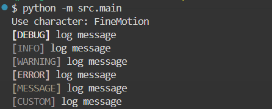

# Ocean-Pearl
Extract theme colour. Playing with [Ocean Pearl](https://www.youtube.com/watch?v=rtqBpP-j4UM).

* **About Ocean Pearl**

> Ocean Pearl·5440
> 
> Smilin' Buddha Cabaret


## Reference

* [qTipTip/Pylette](https://github.com/qTipTip/Pylette)

**Setup**

```sh
uv venv --python 3.12
uv pip install pylette
```

## Theme

*  Format
    ```json
    {
    // name
    "AdmireVega": [
        {
        "rgb": [94, 90, 102], // RGB
        "hex": "#5E5A66",   // hex 
        "frequency": 0.4766365640071331 // percentage of the cluster
        },
        ...
        ]
    }
    ```

* [**Pretty Derby**](https://umamusume.com/)
  *  [characters](https://umamusume.com/characters)
  *  theme file: [prettyderby.json](theme/prettyderby.json)

## Usage

Put hex to console:

* [main](src/main.py)

```sh
python -m src.main
```


